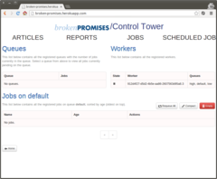
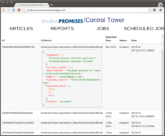
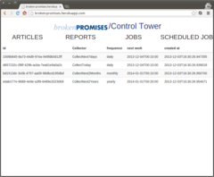

Broken-Promises
===============

[](http://travis-ci.org/jplusplus/broken-promises)


In 2003, an article in the New Scientist stated that bananas could be extinct in 2013. Guess what. This was yet another broken promise.

It can be hard to keep track of all promises and predictions. This tool makes it easier for journalists and citizens to keep an eye on what was promised for a certain date (a day, a month or a year). Articles from the Guardian and the New-York Times are searched for dates and then filtered to remove inadequate results (movie releases, for instance).

## Note

This is only the backend system wich will retrieve articles. To show them, we have build [broken-promises-client](https://github.com/jplusplus/broken-promises-client).

## Installation


**a. Requirements**
```bash
sudo apt-get install build-essential git-core python python-pip python-dev redis-server
sudo pip install virtualenv
```
And [MongoDB](http://www.mongodb.org/downloads).

**b.  Download the project**
```bash
git clone git@github.com:jplusplus/broken-promises.git
cd broken-promises
```

**c. Install**

Will download and install all the dependances in a `venv` directory. (Virtualenv required)

```bash
make install
```

## Run the Application (API + Control Tower)

Launch Mongodb, the workers and the web application (API + Control Tower)

```bash
make run
```

Then visit [http://127.0.0.1:5000](http://127.0.0.1:5000)

__password__ : brokenpromises






## CLI

In the `Scripts/` directory.

### Collect articles for a date

```
Usage: 
./collect_articles.py [options] year 
./collect_articles.py [options] year month
./collect_articles.py [options] year month day

Options:
  -h, --help            show this help message and exit
  -f CHANNELS_FILE, --channelslistfile=CHANNELS_FILE
                        Use this that as channels list to use
  -c CHANNELS_LIST, --channels=CHANNELS_LIST
                        channels list comma separated
  -s, --storage         Save the result with the default storage
  -d, --drop            drop the previous articles from database before
  --force               Force the scrap. If --storage is enable, the scrap
                        could be escape b/c of a previous similar scrap
  -o OUTPUT_FILE, --output=OUTPUT_FILE
                        Specify  a file to write the export to. If you do not
                        specify a file name, the program writes data to
                        standard output (e.g. stdout)

```

### Scrap a given page using the appropriate channel 

```
usage: scrap_article.py [-h] [--with-filters] [--dates] url

positional arguments:
  url             url to scrap

optional arguments:
  -h, --help      show this help message and exit
  --with-filters  Apply filters to remove unwanted dates
  --dates         Return the date found in the article

```
## Run tests

	$ make test
